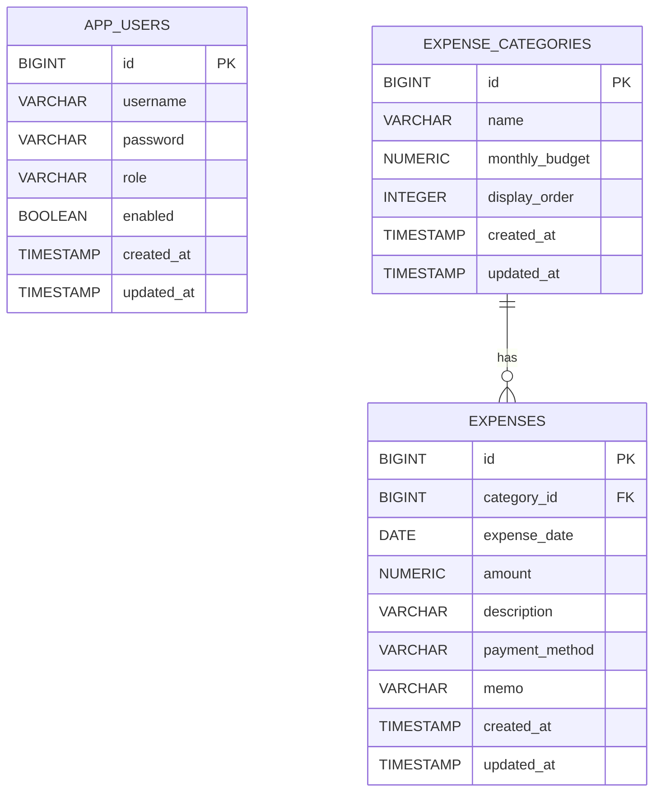

# ExpenseManager

Spring Boot と MyBatis で作成している経費管理システムです。

日々の経費登録、カテゴリ管理、月別集計、予算超過チェック、CSV出力を扱います。`JobManager`、`AttendanceManager`、`InventoryManager` に続く業務システム系ポートフォリオとして、認証、集計SQL、トランザクション、CSV出力を学べる構成にしています。

## 概要

ExpenseManager は、カテゴリごとの月予算と実績を管理するWebアプリケーションです。

単なる個人向け家計簿ではなく、経費申請や部署別予算管理にも発展させやすい「業務アプリ寄り」の題材として設計しています。

## 主な機能

- DB認証ログイン
- ADMIN / USER 権限管理
- ユーザー一覧表示
- ユーザー登録
- ユーザー編集
- ユーザーの有効 / 無効切替
- カテゴリ登録
- カテゴリ編集
- カテゴリ削除
- カテゴリごとの月予算管理
- 経費登録
- 経費編集
- 経費削除
- 経費一覧表示
- キーワード検索
- カテゴリ検索
- 日付範囲検索
- 月別集計
- 予算超過アラート
- 経費一覧CSV出力

## 使用技術

- Java 21
- Spring Boot 3.5
- Spring MVC
- Spring Security
- Thymeleaf
- MyBatis
- PostgreSQL
- Docker / Docker Compose
- Maven
- JUnit 5
- Mockito

## 学習ポイント

- Spring Security によるDB認証
- ロールによる画面・操作制御
- MyBatis Mapper XMLによるSQL管理
- `JOIN` による経費とカテゴリの結合
- `GROUP BY` と `SUM` による月別・カテゴリ別集計
- `@Transactional` による登録・更新・削除処理
- CSV出力
- Docker ComposeによるWebアプリとDBの同時起動
- JUnit / Mockitoによるサービス層テスト

## 起動方法

Docker Desktop を起動してから、プロジェクト直下で以下を実行します。

```powershell
docker compose up -d --build
```

ブラウザで以下にアクセスします。

```text
http://localhost:8082/login
```

## 初期ユーザー

```text
ユーザー名: admin
パスワード: password
権限: ADMIN
```

## DB接続情報

pgAdminなどから確認する場合は以下を使います。

```text
Host: localhost
Port: 5434
Database: expensemanager
Username: postgres
Password: postgres
```

## テスト実行

```powershell
.\scripts\test.ps1
```

## GitHub Actions

`.github/workflows/test.yml` で、`main` へのpush時とPull Request作成時にJUnitテストを自動実行します。

```text
./mvnw test
```

Docker buildやDB起動は含めず、軽量なテスト実行だけにしています。

## 画面

- `/login` ログイン画面
- `/expenses` 経費一覧画面
- `/expenses/new` 経費登録画面
- `/expenses/{id}/edit` 経費編集画面
- `/expenses/export` 経費一覧CSV出力
- `/summary` 月別集計画面
- `/categories` カテゴリ管理画面
- `/users` ユーザー管理画面

## 権限

```text
ADMIN: 経費管理、カテゴリ管理、ユーザー管理、月別集計
USER: 経費管理、月別集計
```

カテゴリ管理とユーザー管理はADMINのみアクセスできます。

## ER図



## 集計SQLの考え方

月別集計では、カテゴリテーブルを基準に経費をLEFT JOINし、対象月の支出合計をカテゴリごとに集計します。

```sql
SELECT
    c.id,
    c.name,
    c.monthly_budget,
    COALESCE(SUM(e.amount), 0) AS total_amount
FROM expense_categories c
LEFT JOIN expenses e
    ON e.category_id = c.id
    AND e.expense_date >= :startDate
    AND e.expense_date <= :endDate
GROUP BY c.id, c.name, c.monthly_budget;
```

このSQLをMyBatis Mapper XMLに記述し、画面表示用DTOへマッピングしています。

## 今後追加したい機能

- README用スクリーンショット
- 予算超過カテゴリのみの絞り込み
- グラフ表示
- 固定費の自動登録
- CSVインポート
